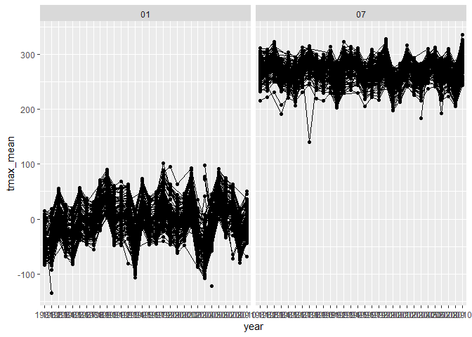

p8105_hw3_qz2493
================
Qingyue Zhuo qz2493
2022-10-11

# Load packages

# Problem 1

## Load the instacard data

``` r
library(p8105.datasets)
data("instacart")
```

# Problem 2

## Load and tidy the “accel” dataset

``` r
accel_data = 
  read_csv("data/accel_data.csv") %>%
  janitor::clean_names() %>%
  pivot_longer(
    activity_1:activity_1440,
    names_to = "activity",
    values_to = "observations") %>%
  mutate(
    day = factor(day),
    day = fct_relevel(day, "Monday", "Tuesday", "Wednesday", "Thursday", "Friday","Saturday", "Sunday"),
    day_type = case_when(
      day %in% c("Monday", "Tuesday", "Wednesday", "Thursday", "Friday") ~ "Weekday",
      day %in% c("Saturday", "Sunday") ~ "Weekend"
    )) %>%
  arrange(week, day)
```

    ## Rows: 35 Columns: 1443
    ## ── Column specification ────────────────────────────────────────────────────────
    ## Delimiter: ","
    ## chr    (1): day
    ## dbl (1442): week, day_id, activity.1, activity.2, activity.3, activity.4, ac...
    ## 
    ## ℹ Use `spec()` to retrieve the full column specification for this data.
    ## ℹ Specify the column types or set `show_col_types = FALSE` to quiet this message.

### This “accel” dataset has 50400 observations of 6 variables. The names of the variables are week, day_id, day, activity, observations, day_type.

## Total activiteis over the day

``` r
accel_data %>%
  group_by(week, day) %>%
  summarize(total_activity = sum(observations)) %>%
  pivot_wider(
    names_from = "day",
    values_from = "total_activity"
  ) %>%
  knitr::kable()
```

    ## `summarise()` has grouped output by 'week'. You can override using the
    ## `.groups` argument.

| week |    Monday |  Tuesday | Wednesday | Thursday |   Friday | Saturday | Sunday |
|-----:|----------:|---------:|----------:|---------:|---------:|---------:|-------:|
|    1 |  78828.07 | 307094.2 |    340115 | 355923.6 | 480542.6 |   376254 | 631105 |
|    2 | 295431.00 | 423245.0 |    440962 | 474048.0 | 568839.0 |   607175 | 422018 |
|    3 | 685910.00 | 381507.0 |    468869 | 371230.0 | 467420.0 |   382928 | 467052 |
|    4 | 409450.00 | 319568.0 |    434460 | 340291.0 | 154049.0 |     1440 | 260617 |
|    5 | 389080.00 | 367824.0 |    445366 | 549658.0 | 620860.0 |     1440 | 138421 |

## 24-hour-activity

``` r
accel_data %>%
  mutate(
    activity = substring(activity, 10),
    activity = as.integer(activity)
  ) %>%
  ggplot(aes(x = activity, y = observations, color = day)) +
  geom_line(alpha = 0.5) +
  scale_x_continuous(
    breaks = c(0, 120, 240, 360, 480, 600, 720, 840, 960, 1080, 1200, 1320, 1440),
    labels = c("0", "2", "4", "6", "8", "10", "12", "14", "16", "18", "20", "22", "24")) +
  labs(
    title = "24-Hour Activity for Each Day",
    x = "Time of Day",
    y = "Activity Level"
  ) +
  theme(legend.position = "bottom")
```

<!-- -->

# Problem 3

## Load and tidy the noaa data

``` r
ny_data = 
  ny_noaa %>%
  janitor::clean_names() %>%
  separate(date, into = c("year", "month", "day"), sep = "-")
```

``` r
ny_data =
  ny_data %>%
  rename(snow_mm = "snow",
         prcp_mm = "prcp",
         snwd_mm = "snwd",
         tmax_F = "tmax",
         tmin_F = "tmin")
```

``` r
ny_data = 
  ny_data %>%
    mutate(tmin_F = as.numeric(tmin_F),
          tmax_F = as.numeric(tmax_F))
```

``` r
df1 = data.frame(ny_data)
names(which.max(table(df1$snow_mm, useNA = "ifany"))) 
```

    ## [1] "0"

### 

### how to ensure that observations for temperature, precipitation, and snowfall are given in reasonable units

### what are the most commonly observed values? why?

### two- panel- plot-

     a. average max temperature in January in each station across the year
     b. average max temperature in July in each station across the year

## two-panel-plot

    a. tmax vs. tmin for the full dataset- non-scatter plot
    b. distribution of snowfall values greater than 0 and less than 100 separately by year

``` r
plot_1 = 
  ny_data %>%
  group_by(id, year, month) %>%
  filter(month %in% c("07","01")) %>%
  summarize(tmax_mean = mean(tmax_F,na.rm = TRUE, color = id)) %>%
  ggplot(aes(x = year, y = tmax_mean,group = id)) +
  geom_point() + geom_path() +
  facet_grid( ~ month)
```

    ## `summarise()` has grouped output by 'id', 'year'. You can override using the
    ## `.groups` argument.

``` r
plot_1
```

    ## Warning: Removed 5970 rows containing missing values (geom_point).

    ## Warning: Removed 5931 row(s) containing missing values (geom_path).

<!-- -->

``` r
plot2 = 
  ny_data %>%
  ggplot(aes(x = tmax_F, y = tmin_F)) +
  geom_hex()


plot3 = 
  ny_data %>%
  group_by(id, year, month) %>%
  filter( snow_mm < 100 & snow_mm > 0) %>%
  ggplot(aes(x = snow_mm, y = year)) +
  geom_density_ridges()
```
