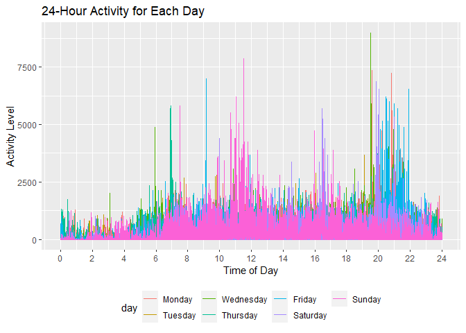
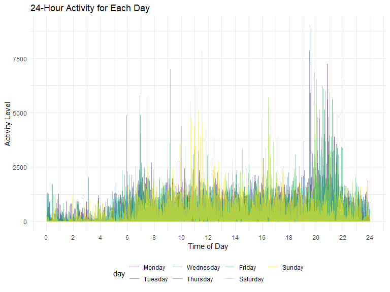
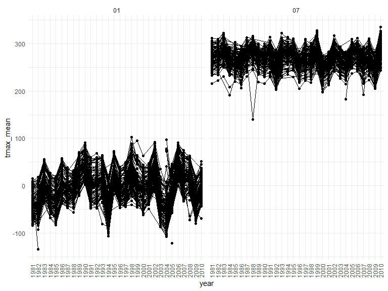
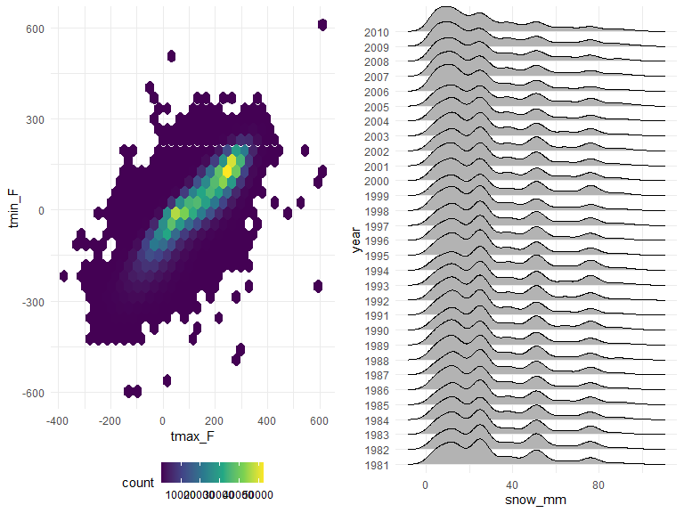

p8105_hw3_qz2493
================
Qingyue Zhuo qz2493
2022-10-11

### Load packages

### Initial settings

``` r
knitr::opts_chunk$set(
    echo = TRUE,
    warning = FALSE,
    fig.width = 8, 
  fig.height = 6,
  out.width = "90%"
)

theme_set(theme_minimal() + theme(legend.position = "bottom"))

options(
  ggplot2.continuous.colour = "viridis",
  ggplot2.continuous.fill = "viridis"
)

scale_colour_discrete = scale_colour_viridis_d
scale_fill_discrete = scale_fill_viridis_d
```

### Problem 1

#### Load the instacard data

``` r
instacart = 
  instacart %>% 
  as_tibble(instacart)
```

#### Answer questions about the data

This dataset contains 1384617 rows and 15 columns, with each row
resprenting a single product from an instacart order. Variables include
identifiers for user, order, and product; the order in which each
product was added to the cart. There are several order-level variables,
describing the day and time of the order, and number of days since prior
order. Then there are several item-specific variables, describing the
product name (e.g. Yogurt, Avocado), department (e.g. dairy and eggs,
produce), and aisle (e.g. yogurt, fresh fruits), and whether the item
has been ordered by this user in the past. In total, there are 39123
products found in 131209 orders from 131209 distinct users.

Below is a table summarizing the number of items ordered from aisle. In
total, there are 134 aisles, with fresh vegetables and fresh fruits
holding the most items ordered by far.

``` r
instacart %>% 
  count(aisle) %>% 
  arrange(desc(n))
```

    ## # A tibble: 134 × 2
    ##    aisle                              n
    ##    <chr>                          <int>
    ##  1 fresh vegetables              150609
    ##  2 fresh fruits                  150473
    ##  3 packaged vegetables fruits     78493
    ##  4 yogurt                         55240
    ##  5 packaged cheese                41699
    ##  6 water seltzer sparkling water  36617
    ##  7 milk                           32644
    ##  8 chips pretzels                 31269
    ##  9 soy lactosefree                26240
    ## 10 bread                          23635
    ## # … with 124 more rows

Next is a plot that shows the number of items ordered in each aisle.
Here, aisles are ordered by ascending number of items.

``` r
instacart %>% 
  count(aisle) %>% 
  filter(n > 10000) %>% 
  mutate(aisle = fct_reorder(aisle, n)) %>% 
  ggplot(aes(x = aisle, y = n)) + 
  geom_point() + 
  labs(title = "Number of items ordered in each aisle") +
  theme(axis.text.x = element_text(angle = 60, hjust = 1))
```



Our next table shows the three most popular items in aisles
`baking ingredients`, `dog food care`, and `packaged vegetables fruits`,
and includes the number of times each item is ordered in your table.

``` r
instacart %>% 
  filter(aisle %in% c("baking ingredients", "dog food care", "packaged vegetables fruits")) %>%
  group_by(aisle) %>% 
  count(product_name) %>% 
  mutate(rank = min_rank(desc(n))) %>% 
  filter(rank < 4) %>% 
  arrange(desc(n)) %>%
  knitr::kable()
```

| aisle                      | product_name                                  |    n | rank |
|:---------------------------|:----------------------------------------------|-----:|-----:|
| packaged vegetables fruits | Organic Baby Spinach                          | 9784 |    1 |
| packaged vegetables fruits | Organic Raspberries                           | 5546 |    2 |
| packaged vegetables fruits | Organic Blueberries                           | 4966 |    3 |
| baking ingredients         | Light Brown Sugar                             |  499 |    1 |
| baking ingredients         | Pure Baking Soda                              |  387 |    2 |
| baking ingredients         | Cane Sugar                                    |  336 |    3 |
| dog food care              | Snack Sticks Chicken & Rice Recipe Dog Treats |   30 |    1 |
| dog food care              | Organix Chicken & Brown Rice Recipe           |   28 |    2 |
| dog food care              | Small Dog Biscuits                            |   26 |    3 |

Finally is a table showing the mean hour of the day at which Pink Lady
Apples and Coffee Ice Cream are ordered on each day of the week. This
table has been formatted in an untidy manner for human readers. Pink
Lady Apples are generally purchased slightly earlier in the day than
Coffee Ice Cream, with the exception of day 5.

``` r
instacart %>%
  filter(product_name %in% c("Pink Lady Apples", "Coffee Ice Cream")) %>%
  group_by(product_name, order_dow) %>%
  summarize(mean_hour = mean(order_hour_of_day)) %>%
  spread(key = order_dow, value = mean_hour) %>%
  knitr::kable(digits = 2)
```

    ## `summarise()` has grouped output by 'product_name'. You can override using the
    ## `.groups` argument.

| product_name     |     0 |     1 |     2 |     3 |     4 |     5 |     6 |
|:-----------------|------:|------:|------:|------:|------:|------:|------:|
| Coffee Ice Cream | 13.77 | 14.32 | 15.38 | 15.32 | 15.22 | 12.26 | 13.83 |
| Pink Lady Apples | 13.44 | 11.36 | 11.70 | 14.25 | 11.55 | 12.78 | 11.94 |

### Problem 2

#### Load and tidy the “accel” dataset

``` r
accel_data = 
  read_csv("data/accel_data.csv") %>%
  janitor::clean_names() %>%
  pivot_longer(
    activity_1:activity_1440,
    names_to = "activity_type",
    values_to = "observations") %>%
  mutate(
    day = factor(day),
    day = fct_relevel(day, "Monday", "Tuesday", "Wednesday", "Thursday", "Friday","Saturday", "Sunday"),
    day_type = case_when(
      day %in% c("Monday", "Tuesday", "Wednesday", "Thursday", "Friday") ~ "Weekday",
      day %in% c("Saturday", "Sunday") ~ "Weekend"
    )) %>%
  arrange(week, day)
```

    ## Rows: 35 Columns: 1443
    ## ── Column specification ────────────────────────────────────────────────────────
    ## Delimiter: ","
    ## chr    (1): day
    ## dbl (1442): week, day_id, activity.1, activity.2, activity.3, activity.4, ac...
    ## 
    ## ℹ Use `spec()` to retrieve the full column specification for this data.
    ## ℹ Specify the column types or set `show_col_types = FALSE` to quiet this message.

I generated binary variable called “day_type” based on the day values,
and pivoted longer the data set according to activity_type and
corresponding observations. The final data set has 50400 observations of
6 variables. The names of the variables are week, day_id, day,
activity_type, observations, day_type.

#### Total activiteis over the day

``` r
accel_data %>%
  group_by(week, day) %>%
  summarize(total_activity = sum(observations)) %>%
  pivot_wider(
    names_from = "day",
    values_from = "total_activity"
  ) %>%
  knitr::kable()
```

    ## `summarise()` has grouped output by 'week'. You can override using the
    ## `.groups` argument.

| week |    Monday |  Tuesday | Wednesday | Thursday |   Friday | Saturday | Sunday |
|-----:|----------:|---------:|----------:|---------:|---------:|---------:|-------:|
|    1 |  78828.07 | 307094.2 |    340115 | 355923.6 | 480542.6 |   376254 | 631105 |
|    2 | 295431.00 | 423245.0 |    440962 | 474048.0 | 568839.0 |   607175 | 422018 |
|    3 | 685910.00 | 381507.0 |    468869 | 371230.0 | 467420.0 |   382928 | 467052 |
|    4 | 409450.00 | 319568.0 |    434460 | 340291.0 | 154049.0 |     1440 | 260617 |
|    5 | 389080.00 | 367824.0 |    445366 | 549658.0 | 620860.0 |     1440 | 138421 |

The pattern of activity includes: 1. The activity of day fluctuated
extensively and no apparent trend exists. 2. The Saturday activity of
forth and fifth week is extremely low, which can be counted as outliers,
indicating the machine may have some problems during these two days. 3.
For the first three weeks, weekend activity is higher than weekday
activity; but for the last two weeks, trend reverses. 4. Viewed
vertically, there is great variance in the amount of activity on Monday,
Friday, and weekends across weeks; while there is smaller separation on
Tuesdays, Wednesdays and Thursdays.

#### 24-hour-activity

``` r
accel_data %>%
  mutate(
    activity = substring(activity_type, 10),
    activity = as.integer(activity)
  ) %>%
  ggplot(aes(x = activity, y = observations, color = day)) +
  geom_line(alpha = 0.5) +
  scale_x_continuous(
    breaks = c(0, 120, 240, 360, 480, 600, 720, 840, 960, 1080, 1200, 1320, 1440),
    labels = c("0", "2", "4", "6", "8", "10", "12", "14", "16", "18", "20", "22", "24")) +
  labs(
    title = "24-Hour Activity for Each Day",
    x = "Time of Day",
    y = "Activity Level"
  ) +
  theme(legend.position = "bottom")
```



My conclusions are: 1. For each day in a week, the lowest activity
always happens between 22:00 pm to 5:00 am, which may due to sleep. 2.
Activity on Sundays and Saturdays are lower than weekdays in general.
However, around 11:00 am on Sunday shows an extremely high activity
level. 3. On weekday evening between 8:00 to 10:00 pm, there is also a
hight activity level.

### Problem 3

#### Load and tidy the noaa data

``` r
ny_data = 
  ny_noaa %>%
  janitor::clean_names() %>%
  separate(date, into = c("year", "month", "day"), sep = "-") %>%
  rename(snow_mm = "snow",
         prcp_mm = "prcp",
         snwd_mm = "snwd",
         tmax_F = "tmax",
         tmin_F = "tmin") %>%
  mutate(tmin_F = as.numeric(tmin_F),
          tmax_F = as.numeric(tmax_F))
```

``` r
df1 = data.frame(ny_data)
names(which.max(table(df1$snow_mm, useNA = "ifany"))) 
```

    ## [1] "0"

For snowfall, the most commonly observed value is “0”, because there is
no snow for most days in NY in a year.

#### two-panel-plot

``` r
plot_1 = 
  ny_data %>%
  group_by(id, year, month) %>%
  filter(month %in% c("07","01")) %>%
  summarize(tmax_mean = mean(tmax_F,na.rm = TRUE, color = id)) %>%
  ggplot(aes(x = year, y = tmax_mean,group = id)) +
  geom_point() + geom_path() +
  facet_grid( ~ month)
```

    ## `summarise()` has grouped output by 'id', 'year'. You can override using the
    ## `.groups` argument.

``` r
plot_1
```



1.  The max temperatures in January are between -200 and 100; while the
    max temperatures in July are between 100 and 400, there is no
    crossover.
2.  The fluctuation pattern in January almost matches with July,
    indicating certain years have higher/lower temperatures across the
    year compared with other years.
3.  One outlier is the max temperature in January in 1982; another
    outlier is the max temperature in July in 1988, both of which are
    extremely low.

``` r
plot2 = 
  ny_data %>%
  ggplot(aes(x = tmax_F, y = tmin_F)) +
  geom_hex()


plot3 = 
  ny_data %>%
  group_by(id, year, month) %>%
  filter( snow_mm < 100 & snow_mm > 0) %>%
  ggplot(aes(x = snow_mm, y = year)) +
  geom_density_ridges()

grid.arrange(plot2, plot3, nrow = 1)
```

    ## Picking joint bandwidth of 3.76



The noaa data set has 2595176variables of 9observations. The variables
are id, year, month, day, prcp_mm, snow_mm, snwd_mm, tmax_F, tmin_F. The
missing data is not a big issue as long as each weather station only
collects a subset of these variables and they can get the observations
they want.
